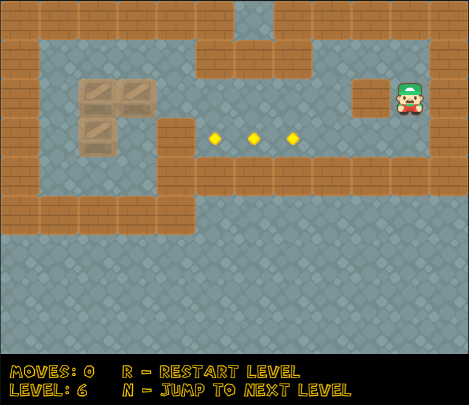

# Sokoban

_Sokoban written in Rust_

## Screenshots



**Please note, that game is in development at the moment, so it is still not comlpleted!**

Commands to build/run:

>_All commands execute from the parent folder (where the "Cargo.toml" file exists)_

To build:
```shell
cargo build --release
```

To run:
```shell
cargo run
```

To make docker container with wasm version:
1 - build the wasm
```shell
cargo build --target wasm32-unknown-unknown -r
```

2 - build docker container:
```shell
docker build -t sokoban .
```

3 - run container:
```shell
docker run -d -p 4000:4000 sokoban:latest
```

4 - access the game from web browser by URL: http://localhost:4000
